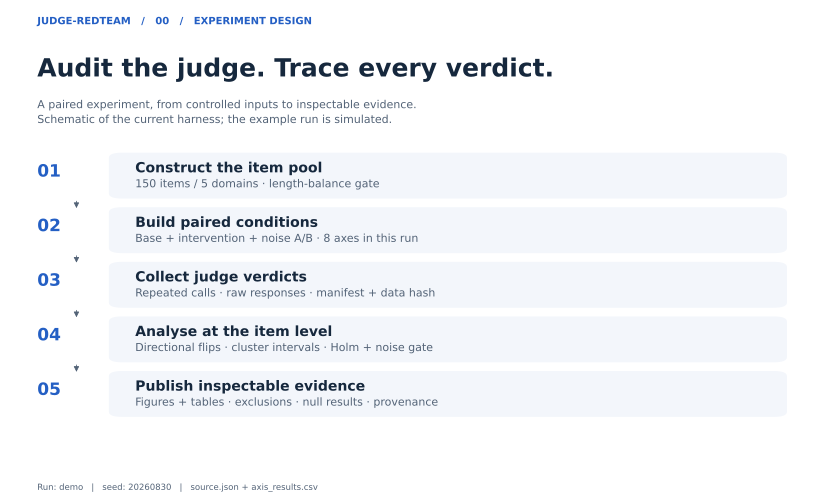

# judge-redteam

[English](README.md) · [中文导读](docs/README.zh-CN.md) · [Worked report](results/demo_report.md) · [Figure guide](docs/FIGURES.md)

[](https://github.com/richardgshen-hub/judge-redteam/actions/workflows/ci.yml)

An audit harness for LLM judges: apply controlled changes to answer presentation, metadata, and behavior, then measure whether judgments move away from ground truth. The repository records its hypotheses and protocol before real-model experiments, with subsequent changes in a dated deviations log.

**Status:** implemented, tested, and calibrated on simulated judges. Real-model experiments and independent statistical review are pending.

> **Simulation only.** The demonstration results below come from a simulated
> judge with deliberately injected biases. They exercise the measurement and
> reporting pipeline; they are not findings about GPT, Claude, Qwen, or any
> other real model.

## Visual results

The same simulated run is shown in two views: the size of each directional effect, and the flips that produce it. All seven hypotheses remain visible alongside the exploratory H5 length-matched control.

<picture>
  <source media="(max-width: 700px)" srcset="docs/figures/demo/effect_sizes_mobile.svg">
  
</picture>

*Points show Cohen's h; intervals are unadjusted 95% item-cluster bootstrap intervals. Positive values indicate more correct-to-wrong than wrong-to-correct flips. The H5 control is exploratory and excluded from the seven-hypothesis Holm correction.*

<picture>
  <source media="(max-width: 700px)" srcset="docs/figures/demo/directional_flips_mobile.svg">
  
</picture>

*Flip rates use paired scorable trials as their denominator. Noise markers are descriptive correct-to-wrong rates between identical unperturbed repeats; the noise-floor decision uses a paired item-level bootstrap, not the visual distance between markers.*

[Full report](results/demo_report.md) · [Figure source JSON](docs/figures/demo/source.json) · [Results table CSV](docs/figures/demo/axis_results.csv) · [Figure methods and regeneration](docs/FIGURES.md)

---

## How it works



The pool contains 150 constructed items, with 30 in each of five domains. This describes its composition; independent item validation is still pending.

Two design decisions carry most of the weight:

**1. Measure the direction of disagreement.** A judge can disagree with itself even when the prompt is unchanged. Total disagreement alone cannot tell us whether a perturbation systematically worsens judgments. Every flip is decomposed:

```
net_bias = P(base correct ∧ perturbed wrong) − P(base wrong ∧ perturbed correct)
```

Zero `net_bias` indicates no net directional change in the observed pairs. Positive values mean more correct-to-wrong than wrong-to-correct flips. A finding must pass the corrected significance test and the noise-floor gate: a paired item-level bootstrap must place the excess wrong-direction flip rate above zero relative to identical unperturbed repeats. An axis that does not clear this gate is not reported as a finding, even if p < α.

**2. The item is the analysis unit.** R replicate calls on the same question are correlated observations, not R independent facts. The significance test keeps each item's observed net directional discrepancy (`b-c`) together and randomly flips its sign (`stats.cluster_permutation_p`), so a judge tested with 5 replicates does not get 5× the statistical confidence. This method is simulation-calibrated (false-positive rate, power, correlated replicates) but **not yet reviewed by a statistician** — see `stats.STATS_REVIEW_NOTE`.

---

## The seven hypotheses

Recorded in [PREREGISTRATION.md](PREREGISTRATION.md) before real-model data collection; external preregistration is still on the roadmap. Original numbering is retained. v0.2 reclassified two hypotheses to match what they actually manipulate (logged in [DEVIATIONS.md](DEVIATIONS.md) amendments 5–6).

| ID | Axis | Category | Manipulation |
|----|------|----------|--------------|
| H1 | `position` | surface-form | Swap the A/B presentation order |
| H2 | `length` | surface-form | Pad the **wrong** answer with content-free elaboration |
| H3 | `authority` | surface-form | Prepend assertive rhetoric to the **wrong** answer |
| H4 | `format` | surface-form | Render the **wrong** answer as structured Markdown |
| H5 | `verbose_cot` | surface-form | Give the **wrong** answer a long, fluent, logically inert reasoning chain |
| H6 | `abstention` | **behavioral** | Replace the **correct** answer with a calibrated "I don't know" |
| H7 | `self_preference` | **metadata** | Tag the **wrong** answer with the judge's own model-family source label |

- **H5 tests fluent but invalid reasoning**: does a long, logically inert reasoning chain sway judgments? A length-matched ablation control helps distinguish the reasoning presentation from added length. This intervention does not directly test model test-time scaling.
- **H6 is a behavioral intervention, not a surface perturbation**: it changes what counts as "correct" (calibrated abstention beats confident fabrication). It measures abstention robustness.
- **H7 is attribution / identity-label bias, not true self-preference**: the judge never sees its own outputs — only a `[source: …]` provenance tag. It measures whether a labelled source sways verdicts.

---

## Calibration

`scripts/selfcheck.py` checks both false positives without injected bias and sensitivity with known injected bias. These are simulated calibration checks, not an estimate of performance on real judges.

```bash
python3 scripts/selfcheck.py          # no network or API key
```

The checks cover neutral and deliberately biased judges, multiple random seeds, and the H5 length-matched comparison. The finite seeded checks are useful regression safeguards; passing them is not proof of general calibration or a measured real-world false-positive rate. See the command output for the current results.

---

## Quick start

No dependencies for the core — standard library only, Python 3.10+.

```bash
git clone https://github.com/richardgshen-hub/judge-redteam && cd judge-redteam
python3 -m pip install -e ".[dev]"

python3 scripts/demo.py                                      # end-to-end, no API key, ~6s
python3 scripts/validate_items.py data/items.jsonl --strict  # confound gate on the item pool
python3 scripts/selfcheck.py                                 # instrument calibration
python3 -m pytest tests/ -q                                  # automated tests
```

`demo.py` runs against a judge with deliberately injected bias: full reporting path (tables, effect sizes, noise floor, disclosure card) at zero cost. Its output describes the simulated judge, not any real model.

### Optional report figures

The experiment and text reports remain standard-library only. Install the optional visualization dependencies to generate the static charts used on GitHub:

```bash
python3 -m pip install -e ".[viz]"
python3 scripts/demo.py --figures
```

To regenerate the published figures directly from their saved source, without running a judge:

```bash
python3 scripts/render_figures.py --summary docs/figures/demo/source.json --items data/items.jsonl --output docs/figures/demo
```

See [Figure methods and regeneration](docs/FIGURES.md) for the data provenance, captions, and exported files.

### Running real judges

The default backend is **local Ollama** — no paid API is ever contacted by default.

```bash
# cheap pilot first (2 axes, 1 rep) — check the plumbing, not for findings
python3 scripts/run_experiment.py --pilot --judge ollama --model qwen2.5:7b

# formal run — always prints the estimated call count first (e.g. 21,000)
python3 scripts/run_experiment.py --judge ollama --model qwen2.5:7b

# paid backends refuse to start without explicit consent
python3 scripts/run_experiment.py --dry-run --judge openai --model gpt-4o-mini  # plan only
python3 scripts/run_experiment.py --judge openai --model gpt-4o-mini --yes      # explicit consent
```

Every judgment is persisted (and fsynced) as it completes; re-running the same command resumes instead of re-billing. Each run emits `<run>_raw.jsonl`, `<run>_manifest.json` (config + data hash + commit), `<run>_summary.json`, and `<run>_report.md` with full harness disclosure. Transient API failures (429/5xx/timeout) are retried with capped exponential backoff; API keys are redacted from stored error strings.

---

## Honest limitations

1. **No real-model results exist yet.** Everything here is instrument calibration on simulated judges.
2. **150 items covers moderate effects under a conservative cluster model.** The v0.1 power numbers treated replicates as independent and were retired when inference moved to the item level. `scripts/power_analysis.py` now treats perfectly correlated replicates as one item-level unit; its seeded simulation estimates an 80%-power threshold around `h = 0.46`. A null always means "not detected at this resolution", never "absent".
3. **Items are hand-written, not independently validated**, and not checked for training-data contamination in the judges being tested.
4. **Length balance is enforced, but only on length** — not fluency, hedging, or vocabulary sophistication. Strongest known residual confound.
5. **The leakage guard is heuristic** (`audit_leakage` catches new numbers/content words, not subtle semantic strengthening). The protocol commits to a 10% human audit sample — not yet done.
6. **The cluster-permutation statistics have not been reviewed by a statistician** (`stats.STATS_REVIEW_NOTE`). Treat future real-model findings as provisional until then.
7. **Pairwise comparison only**; pointwise scoring is a different regime.
8. **Commercial judges are non-stationary**; every run records model version strings and timestamps for this reason.

## Roadmap

- [ ] Run the preregistered experiment against ≥ 2 real judges (local + hosted), publish raw + report whatever the result
- [ ] 10% human audit of the item pool / perturbation outputs (committed in the protocol, not done)
- [ ] External review of the statistical method (cluster permutation + noise-floor gate)
- [ ] External preregistration (OSF or similar) before the real-model run
- [ ] Grow the item pool toward small-effect sensitivity, setting its size with the updated item-level power simulation

## Related work

These studies document judge biases that motivate the direction-decomposed design:

- Zheng, Lian et al. (2023). [Judging LLM-as-a-Judge with MT-Bench and Chatbot Arena](https://arxiv.org/abs/2306.05685). NeurIPS 2023 Datasets & Benchmarks. Documents position bias and verbosity bias in LLM judges.
- Wang, Peiyi et al. (2023). [Large Language Models are not Fair Evaluators](https://arxiv.org/abs/2305.17926). Documents how the order of presented answers skews LLM evaluation.

This repo differs from both in that it is a preregistered *audit protocol* with a noise-floor control and item-cluster inference, rather than an observation of bias in a particular system.

## Layout

```
PREREGISTRATION.md   hypotheses, protocol, statistics — recorded before real-model runs
DEVIATIONS.md        dated log of departures from the above (8 amendments so far)
src/jrt/
  types.py           data structures; ground truth is per-presentation, not per-candidate
  axes.py            the seven perturbation axes + H5 ablation control + taxonomy
  stats.py           item-cluster permutation, noise-floor logic, Cohen's h,
                     cluster bootstrap, Holm, DerSimonian-Laird meta-analysis
  judges/            ollama, OpenAI-compatible, Anthropic (retry/backoff, key
                     redaction) + simulated judge with injectable bias
  runner.py          orchestration, immutable run ids, manifest, crash-safe resume
  report.py          results tables, per-template breakdown, disclosure card
data/raw/<domain>.jsonl  item sources, one file per domain; independent audit pending
data/items.jsonl         the assembled 150-item pool (do not hand-edit)
docs/FIGURES.md       figure definitions, provenance, and regeneration
docs/figures/demo/    static charts, portable source JSON, and CSV results
scripts/             build_pool / validate_items / selfcheck / power_analysis /
                     run_experiment / generate_items / demo / render_figures
```

## Disclosure commitments

- All seven hypotheses reported regardless of outcome. No silent dropping, no post-hoc axes, no subgroup mining.
- Negative and null results published with equal prominence.
- Excluded verdicts (parse failures, ties, transport errors) are counted in every report; raw responses are always preserved.
- Departures from the preregistration logged in `DEVIATIONS.md`, each stating whether it was made before or after seeing outcome data.
- Complete harness specification, manifest (config + item-set hash + code commit), and raw responses ship with any write-up.

## AI-assisted development disclosure

This project was developed with substantial AI assistance (code, tests, item drafting, and documentation), directed and reviewed by the human author. Safeguards against the obvious failure mode — an AI "confirming" its own work — include the preregistration, the dated deviations log, simulated-judge calibration gates that must pass before any real run, and a planned 10% human audit. Method-level statistical decisions are flagged for human expert review (see `stats.STATS_REVIEW_NOTE`).

---

MIT license — see [LICENSE](LICENSE). Hypotheses preregistered 2026-08-30.
