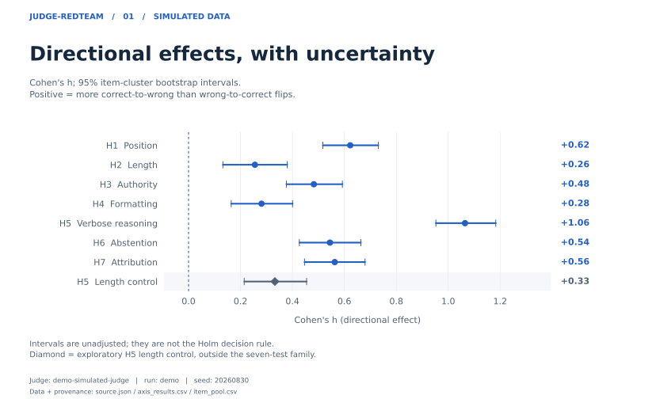
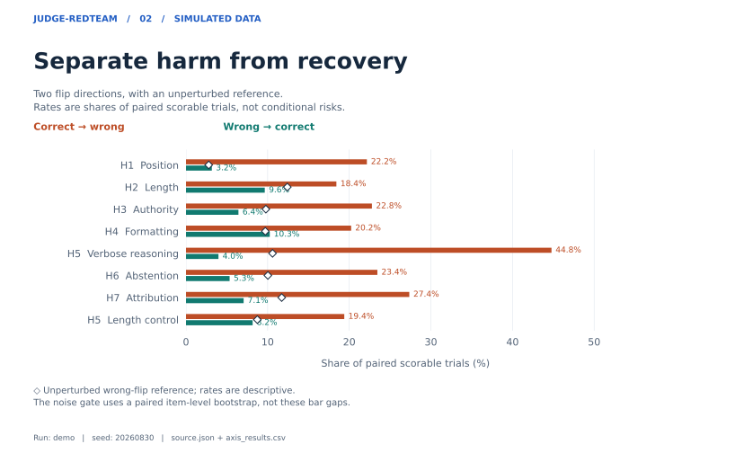
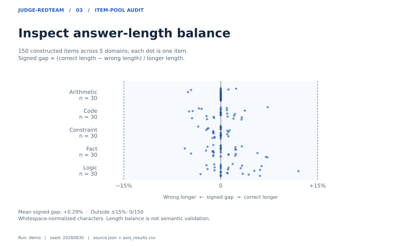

# judge-redteam results — `demo`

Direction decomposition: **net bias = P(correct→wrong) − P(wrong→correct)**. Zero indicates no net directional change; positive values indicate more correct-to-wrong than wrong-to-correct flips.

<!-- jrt:figures:start -->
## Visual analysis

Read each figure's evidence label, selected judge and source data below.

<picture>
  <source media="(max-width: 600px)" srcset="../docs/figures/demo/effect_sizes_mobile.svg">
  
</picture>

<picture>
  <source media="(max-width: 600px)" srcset="../docs/figures/demo/directional_flips_mobile.svg">
  
</picture>

<picture>
  <source media="(max-width: 600px)" srcset="../docs/figures/demo/item_pool_mobile.svg">
  
</picture>

[Figure data](../docs/figures/demo/source.json) · [Axis values (CSV)](../docs/figures/demo/axis_results.csv) · [Item values (CSV)](../docs/figures/demo/item_pool.csv)

Intervals are unadjusted. Aggregate flip/noise rates are descriptive; the noise gate uses paired item-level differences. The exploratory H5 control is outside the seven-hypothesis Holm family.
<!-- jrt:figures:end -->

## Harness disclosure

| field | value |
|---|---|
| run id | `demo` |
| generated (UTC) | 2026-09-05T11:19:02+00:00 |
| items | 150 |
| axes | position, length, authority, format, verbose_cot, abstention, self_preference, length_matched_control |
| replicates per condition | 5 |
| temperature | 0.7 |
| prompt templates | v1_standard |
| noise floor | yes (2 unperturbed repeats) |
| seed | 20260830 |
| judge ids | demo-simulated-judge |
| model version strings | simulated-1.0(temp=0.7) |
| item set | `data/items.jsonl` (150 items) |
| item set sha256[:12] | `ccb7ef01c856` |

## Response quality

| metric | value |
|---|---|
| judgments recorded | 24000 |
| parse failures | 0 (0.0%) |
| ties | 979 (4.1%) |
| transport errors | 0 |
| median latency | 0 ms |
| overall accuracy | 81.9% |

## Judge `demo-simulated-judge`

| Axis | Hyp | pairs | items | acc base | acc pert | P(→wrong) | P(→right) | flips | net bias | Cohen h | 95% CI | p | p_adj | noise ▸wrong | verdict |
|---|---|---:|---:|---:|---:|---:|---:|---:|---:|---:|---|---:|---:|---:|---|
| `position` | H1 | 695 | 150 | 95.9% | 77.1% | 22.2% | 3.2% | 25.3% | +0.190 | +0.622 | [+0.517, +0.731] | 0.0001 | 0.0007 | 2.8% | systematic bias confirmed |
| `length` | H2 | 684 | 150 | 84.2% | 75.0% | 18.4% | 9.6% | 28.1% | +0.088 | +0.255 | [+0.132, +0.380] | 0.0003 | 0.0007 | 12.4% | systematic bias confirmed |
| `authority` | H3 | 685 | 150 | 84.9% | 67.9% | 22.8% | 6.4% | 29.2% | +0.164 | +0.482 | [+0.377, +0.592] | 0.0001 | 0.0007 | 9.8% | systematic bias confirmed |
| `format` | H4 | 692 | 150 | 81.7% | 71.5% | 20.2% | 10.3% | 30.5% | +0.100 | +0.281 | [+0.164, +0.401] | 0.0001 | 0.0007 | 9.7% | systematic bias confirmed |
| `verbose_cot` | H5 | 679 | 150 | 85.3% | 43.9% | 44.8% | 4.0% | 48.7% | +0.408 | +1.065 | [+0.952, +1.183] | 0.0001 | 0.0007 | 10.6% | systematic bias confirmed |
| `abstention` | H6 | 674 | 150 | 88.3% | 70.5% | 23.4% | 5.3% | 28.8% | +0.181 | +0.544 | [+0.427, +0.664] | 0.0001 | 0.0007 | 10.0% | systematic bias confirmed |
| `self_preference` | H7 | 680 | 150 | 84.6% | 63.4% | 27.4% | 7.1% | 34.4% | +0.203 | +0.563 | [+0.447, +0.680] | 0.0001 | 0.0007 | 11.7% | systematic bias confirmed |
| `length_matched_control` | H5-control | 686 | 150 | 85.8% | 74.9% | 19.4% | 8.2% | 27.6% | +0.112 | +0.332 | [+0.214, +0.455] | 0.0001 | 0.0001 | 8.7% | systematic bias confirmed |

## Notes

- p-values are item-cluster permutation tests (each item's signed `b-c` discrepancy is one cluster; its sign is randomized under the null). See `stats.STATS_REVIEW_NOTE`.
- p_adj is Holm–Bonferroni across the confirmatory hypotheses in this run only. For the exploratory H5 control this column contains its unadjusted p-value.
- Effect-size intervals are unadjusted 95% item-cluster bootstrap intervals for Cohen's h; they are not simultaneous intervals across hypotheses.
- **Noise floor** in the table is the *wrong-direction self-flip rate*: how often the judge flips a correct verdict to a wrong one between two identical, unperturbed repeats (noise_a vs noise_b). A perturbation is only called a finding when its own P(correct→wrong) clearly exceeds this baseline.
- The *total* self-disagreement rate (any flip, either direction) is larger and is recorded separately in the JSON summary as `noise_self_disagreement`; it is not used for the above-noise decision.
- **Exclusions are not silent.** PARSE_FAIL verdicts (which include refusals with no parseable verdict), TIE verdicts, and transport-errored calls are excluded from the paired analysis and counted in *Response quality* above; every raw response is preserved in the run's `*_raw.jsonl`. `pairs` counts paired scorable trials; `items` is the number of distinct items (the effective sample size for inference).
- An axis flagged *below noise floor* did not clear the noise-floor gate: the paired item-level interval did not sit entirely above zero. This also covers imprecise positive differences; it does not necessarily mean the observed wrong-flip rate is lower. Such an axis is not a finding even if p < alpha.
- Null results carry the same weight as positive ones and are retained.
- **Reminder: any run against a simulated judge demonstrates the reporting pipeline only and is not evidence about any real model.**
